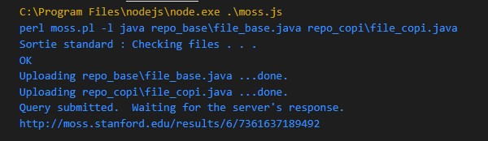
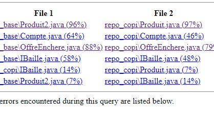

# Moss Detector

Bienvenue dans ce dépôt qui facilite l'utilisation de Moss, un détecteur de plagiat pour le code source. Avec ce code, vous n'avez plus besoin de vous soucier de la configuration et de l'exécution de Moss. Il vous suffit de déposer vos fichiers de base dans le répertoire repo_base et les fichiers à comparer dans le répertoire repo_copi.


### Prérequis

* [![Perl][Perl]][Perl-url]
* [![Node][Node.js]][Node-url]
* [![NPM][NPM]][NPM-url]
* [![Python][Python]][Python-url]


<p align="right">(<a href="#readme-top">back to top</a>)</p>


<!-- GETTING STARTED -->
## Démarrage
**AVANT TOUTE CHOSE, VOUS DEVEZ AVOIR PERL D'INSTALLER !.**
__Installer Perl__ : <a href="https://www.perl.org/get.html" target="_blank">Perl</a>


Ensuite :

    Déposez vos fichiers de base dans le répertoire repo_base.
    Déposez vos fichiers à comparer dans le répertoire repo_copi.


<br>
<br>

### Installation

Pour installer les dépendances, il suffit de lancer la commande suivante :


  ```sh
  npm i
  ```

 ```sh
node moss.js
  ```


## Example



<br><br>
Cliquer sur le lien pour voir le rapport. <br><br>



<!-- ROADMAP -->
## Roadmap

- [ ] Ajoutez des commandes customs
- [ ] Ajoutez plusieurs langages


Voir les [issues](https://github.com/jins5/) pour une liste complète des fonctionnalités proposées (et des problèmes connus).


<!-- LICENSE -->
## License

Distributed under the MIT License. See `Apache` for more information.

<p align="right">(<a href="#readme-top">back to top</a>)</p>


<!-- CONTACT -->
## Contact

Jins - [My portfolio](jins5.github.io/portfolio)

Project Link: [https://github.com/jins5/moss-detector](https://github.com/jins5/moss-detector)


[Node.js]: https://img.shields.io/badge/Node.js-339933?style=for-the-badge&logo=nodedotjs&logoColor=white
[Node-url]: https://nodejs.org/en/
[NPM]: https://img.shields.io/badge/NPM-CB3837?style=for-the-badge&logo=npm&logoColor=white
[NPM-url]: https://www.npmjs.com/
[Perl]: https://img.shields.io/badge/Perl-39457E?style=for-the-badge&logo=perl&logoColor=white
[Perl-url]: https://www.perl.org/
[Python]: https://img.shields.io/badge/Python-3776AB?style=for-the-badge&logo=python&logoColor=white
[Python-url]: https://www.python.org/


