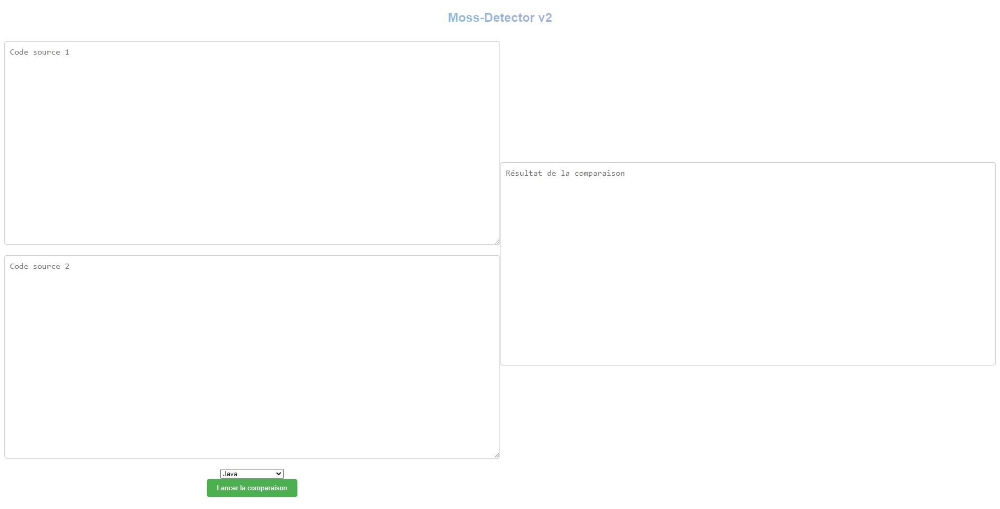

# Moss Detector

Bienvenue dans ce dépôt qui facilite l'utilisation de Moss, un détecteur de plagiat pour le code source. Avec ce code, vous n'avez plus besoin de vous soucier de la configuration et de l'exécution de Moss. Il vous suffit de déposer vos fichiers de base dans le répertoire repo_base et les fichiers à comparer dans le répertoire repo_copi ou d'utiliser l'interface !


### Prerequis

* [![Perl][Perl]][Perl-url]
* [![Node][Node.js]][Node-url]
* [![NPM][NPM]][NPM-url]
* [![Python][Python]][Python-url]


<!-- GETTING STARTED -->
## Démarrage

**AVANT TOUTE CHOSE, VOUS DEVEZ AVOIR PERL, PYTHON ET NODE.JS D'INSTALLER !.**  
__Installer Perl__ : <a href="https://www.perl.org/get.html" target="_blank">Perl</a>  
__Installer Node.js__ : <a href="https://nodejs.org/en" target="_blank">Node.js</a>  
__Installer Python__ : <a href="https://www.python.org/" target="_blank">Python</a>


Ensuite :

    Déposez vos fichiers de base dans le répertoire repo_base.
    Déposez vos fichiers à comparer dans le répertoire repo_copi.


<br>

### Installation

Pour installer les dépendances, il suffit de lancer la commande suivante :


  ```sh
  npm i
  ```

 ```sh
node moss.js
  ```

<br><br>

### Exemples: 


<br><br>
Cliquer sur le lien pour voir le rapport. <br><br>


<br><br>
# Interface (optionnel) :


  
  


<br><br>
Pour lancer l'interface, il suffit de lancer la commande suivante :
```sh
  node mossInterface.js
  ```
Et de se rendre sur l'adresse suivante : http://localhost:3000/ <br><br>

Ou de se rendre sur l'adresse suivante : https://moss-detector.herokuapp.com/ <br><br>

## Issues

/!\ **ATTENTION** /!\\
Si vous rencontrez un problème, merci de vérifier que vous avez bien suivi les instructions ci-dessus.

<br>

#### Erreur concernant le fichier ``moss.pl``
Si le problème persiste, récuperer le fichier ``moss.pl`` chez moss.stanford.edu et le placer dans le contenue dans ``moss.pl``.

Pour ce faire envoyer un mail avec ce contenue à l'adresse suivante (moss@moss.stanford.edu) :


``registeruser``  
``mail votreEmail@domain.com``

Seulement ce contenue, pas de message supplémentaire, et pas de Sujet.
Vous recevrez un mail avec le contenue de ``moss.pl``, il suffit de le copier dans le fichier ``moss.pl``.

<br>

### Sinon :

Voir les [issues](https://github.com/jins5/) pour une liste complète des fonctionnalités proposées (et des problèmes connus).
Ou de créer une issue pour signaler un problème ou une fonctionnalité.


<br><br>
<!-- LICENSE -->
## License

Distributed under the MIT License. See `Apache` for more information.

<p align="right">(<a href="#Prerequis">back to top</a>)</p>


<!-- CONTACT -->
## Contact

Jins - [My portfolio](jins5.github.io/portfolio)

Project Link: [https://github.com/jins5/moss-detector](https://github.com/jins5/moss-detector)


[Node.js]: https://img.shields.io/badge/Node.js-339933?style=for-the-badge&logo=nodedotjs&logoColor=white
[Node-url]: https://nodejs.org/en/
[NPM]: https://img.shields.io/badge/NPM-CB3837?style=for-the-badge&logo=npm&logoColor=white
[NPM-url]: https://www.npmjs.com/
[Perl]: https://img.shields.io/badge/Perl-39457E?style=for-the-badge&logo=perl&logoColor=white
[Perl-url]: https://www.perl.org/
[Python]: https://img.shields.io/badge/Python-3776AB?style=for-the-badge&logo=python&logoColor=white
[Python-url]: https://www.python.org/


